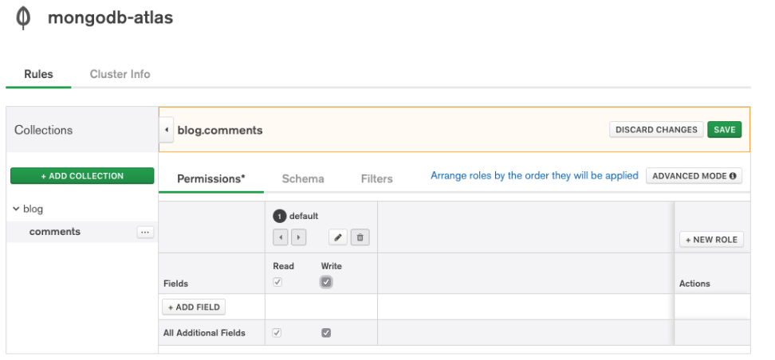
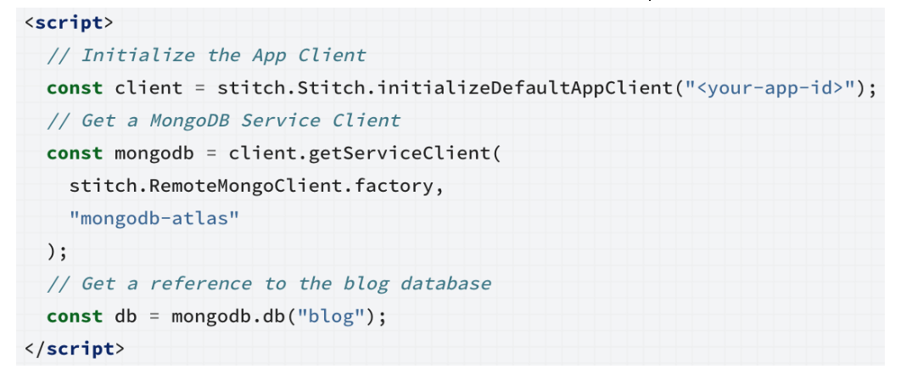
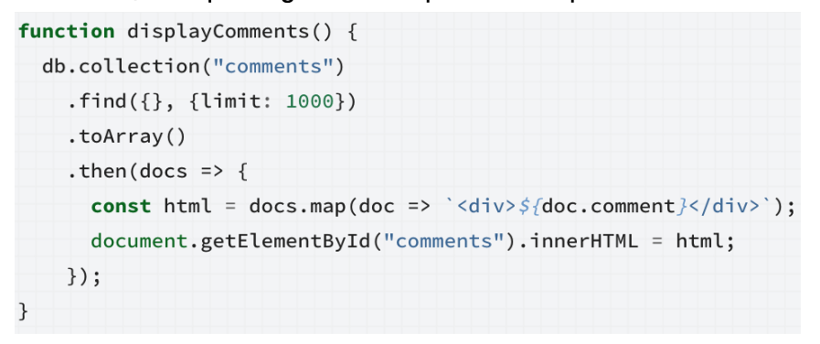
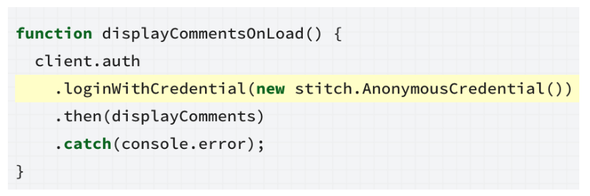
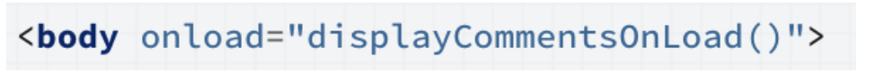
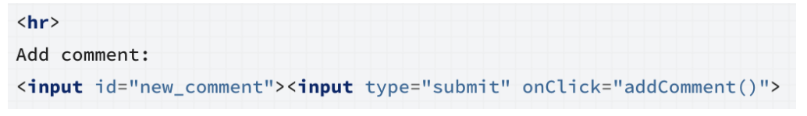
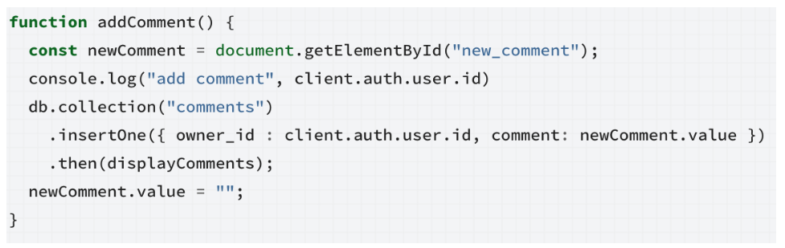

# Background: 

Though this interactive part of the workshop, we will be following along together in building a sample blog using MongoDB Atlas and MongoDB Stitch. Prerequisites are that you have deployed a MongoDB Atlas cluster (an M0 free-tier will suffice) and created a Stitch App tied to that cluster.

We will then be following along the tutorial found here: 
https://docs.mongodb.com/stitch/tutorials/blog-overview/ or via a shortened link: https://bit.ly/2WJyUiA

If at any time you have questions, please raise your hand a MongoDB expert will be around to assist.

# A Basic Blog:
* Create an HTML file (here called blog.html or index.html)


* Create a Stitch App
* Turn on Anonymous Authentication for your Stitch App
* Create a database called blog with a collection called `comments`
* Create a Rule in MongoDB Stitch:
  * Choose the comments `collection`
  * Choose “No Template”
  * After rule is created, check the read and write checkboxes and press “Save”. Now everyone had read and write access through anonymous authentication.



* In the HTML page, add an include for the Sitch Javascript Library:

```
<script src="https://s3.amazonaws.com/stitch-sdks/js/bundles/4.3.1/stitch.js"></script>
```

* Add the following JavaScript at the end of your blog HTML file:



* In the Stitch web portal, find your Stitch App ID and copy it to the clipboard and replace the app ID in the above snippet. We now have the boilerplate JavaScript code needed to use MongoDB Stitch Query AnyWhere to make a connection to your MongoDB collection.

* Next we need to actually issue that query to the database (a simple .find()). Add the following above the </script> tag line in the previous step:



* We now have JavaScript code that will query the collection. However to be able to use it, we must log in first. So write a JavaScript function to log in to Stitch with the Anonymous authentication we enabled earlier:



* To make the blog load when your page is loaded, edit your HTML body tag to look like:



* Open your HTML page in your browser and it should now load any comments in your collection and display them on the page.


# Adding Comments:
Of course, you don’t have any data in the collection yet. Let’s add a way to write a comment:

* First lets make the HTML needed for data entry. Here just a simple text box and a button. This can go below the </div> in the code added previously:



* Now let’s write the JavaScript to take that user information and send it to Stitch and place it above the </script> tag:



* Visit the HTML page and write a comment and submit it. Your now have a comment system on your blog.

# Extra Credit:

MongoDB Atlas and Stitch have extra features up its sleeve to improve this blog. Here are some examples you may be interested in furthering this application: 

* **Extend to writing blog posts**
  * Create another collection called posts and extend your application to no longer be a static single blog post
  * Consider also changing your document schema… Create a collection called blog that stores the blog post itself and all comments as an array.
* **Enable Stitch Hosting and upload your HTML page**
  * This allows for static hosting of CSS, HTML, JavaScript, etc 
  * You can even enable custom domain support
  * https://docs.mongodb.com/stitch/hosting/
* **Source Control**
  * Use the Stitch CLI client to export and import your project, then place that code into source control, like GitHub
  * https://docs.mongodb.com/stitch/import-export/stitch-cli-reference/
* **Authentication Providers**
  * Add email/password, Google, or Facebook Auth Provider to your application
  * https://docs.mongodb.com/stitch/authentication/userpass/
* **Rules**
  * In conjunction with the previous step, change your Rules to allow only logged in users to create posts but allow anyone (anonymous) to view them
  * Add a flag to the documents of is_published and create a Filter to only allow published posts
  * https://docs.mongodb.com/stitch/mongodb/#rules
* **Integrations**
  * Use the Twilio integration to send you a text message on a new comment or post
    * https://docs.mongodb.com/stitch/services/twilio/
  * Use the AWS integration to allow for a hero banner image of the blog post to be uploaded to S3
    * https://docs.mongodb.com/stitch/services/snippets/aws-s3-snippets/
    * https://github.com/graboskyc/PhillyMUG201903
  * Create a Stitch Trigger to call AWS Comprehend or Azure Text Analysis services to see if people are happy or not with your blog posts
    * https://docs.mongodb.com/stitch/triggers/
  * Send a Slack message when someone creates a comment or allow posting comments from Slack
    * https://www.mongodb.com/blog/post/build-a-slack-app-in-10-minutes-with-mongodb-stitch
