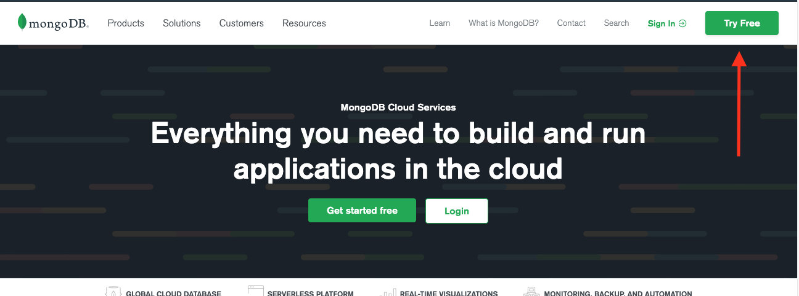
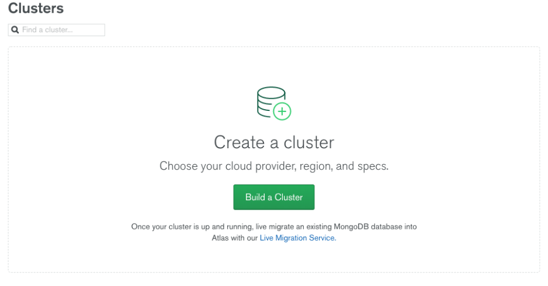
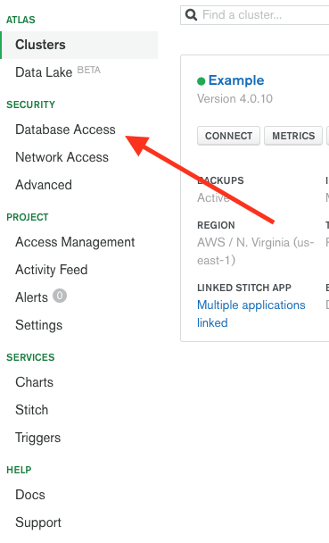
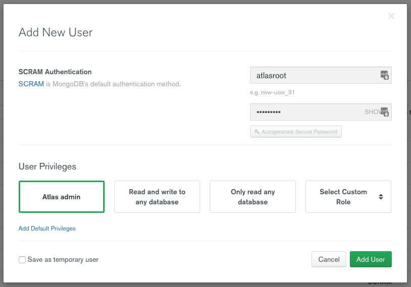
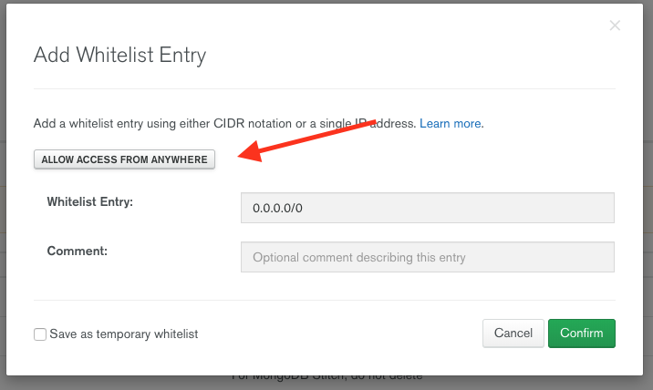
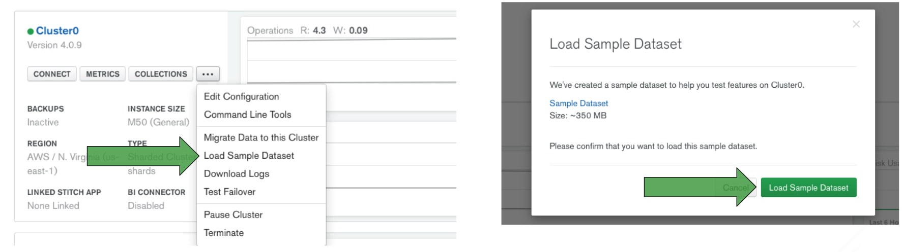

# MongoDB Setup
* Create a free account on MongoDB Atlas on [cloud.mongodb.com](https://cloud.mongodb.com) Click on “Try Free”at the top right if you do not have an account or “Sign In” if you already have a login. 

* Once on the MongoDB Atlas Homepage, select “Build a Cluster”

* Create New Cluster by selecting AWS as thr “Cloud Provider” and leave all other settings as-is and click "Create Cluster" on the bottom right to deploy your M0 (free) cluster

* While this spins up, lets click on the “Database Access” submenu, under “Security” on the left menu. 

* Click the green “Add New User” button on top right

* Enter a user name. For our demo, let’s enter `atlasroot` and enter a secure password.  Record your user name and password in a safe location for reference later. Under “User Privileges”, select “Atlas admin” and click on the “Add User button to complete this section.

* Lets click on the “Network Access” submenu, under “Security” on the left menu. Click on the green “Add IP Address” button in the top right.

* Select “Allow Access from Anywhere” for the purpose of this demo and click on “Confirm”.  

*Note*:  When actually putting something into production, you will want to narrow the scope of where your database can be accessed and specify a specific IP address/CIDR block.

* On the left, go to “Clusters” submenu, under “Atlas” on the left menu to go back to the main page. 

* Click the `...` button, then "Load Sample Dataset" and confirm the load. This may take several minutes. 

* Click on “Connect” button. A window will open. Select “Connect Your Application.” Choose Python and copy the connection string they give you. We will need this later.