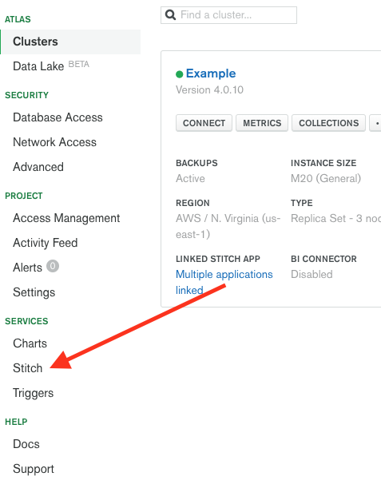
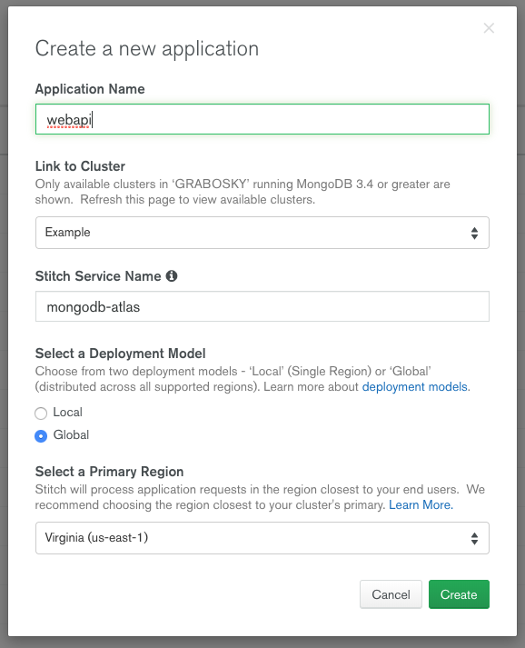
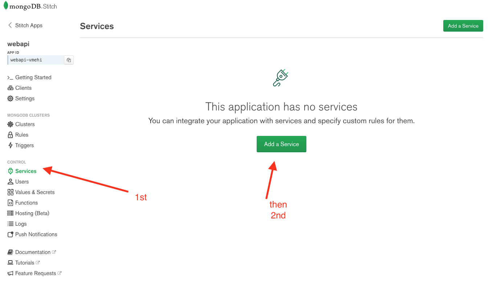
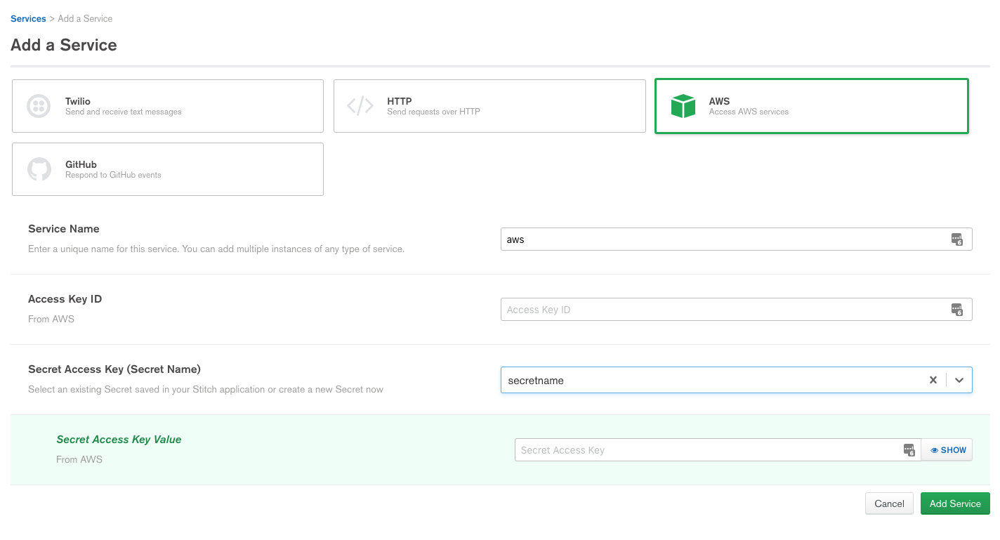
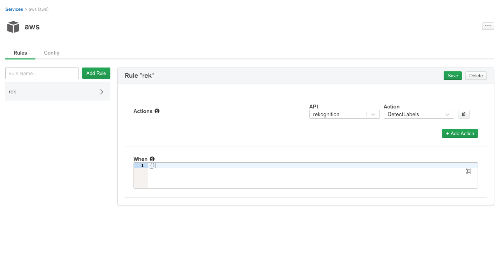
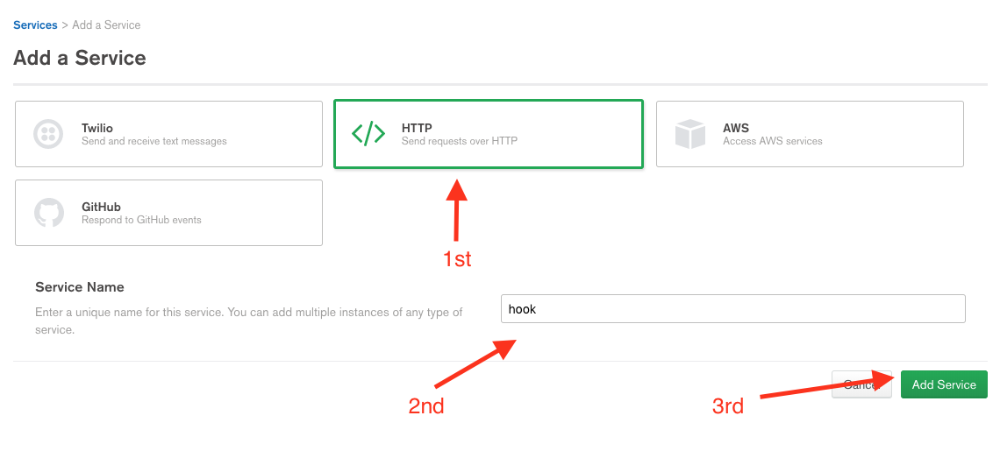
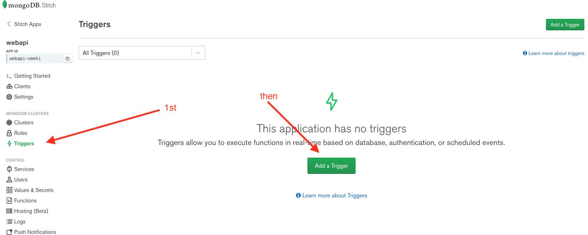
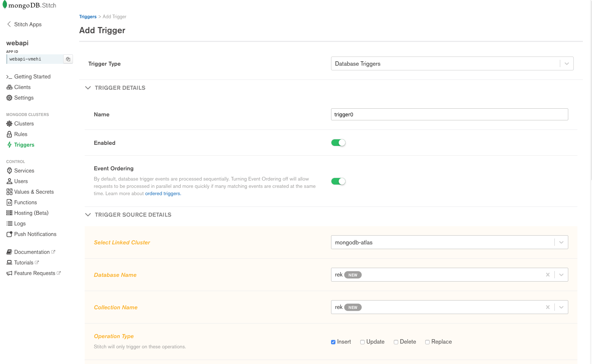
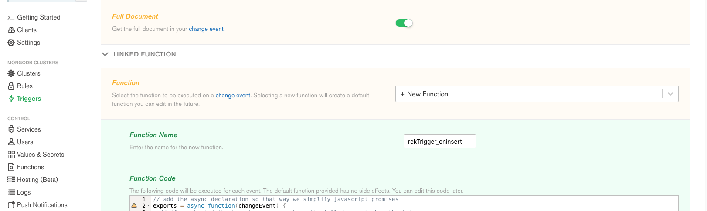
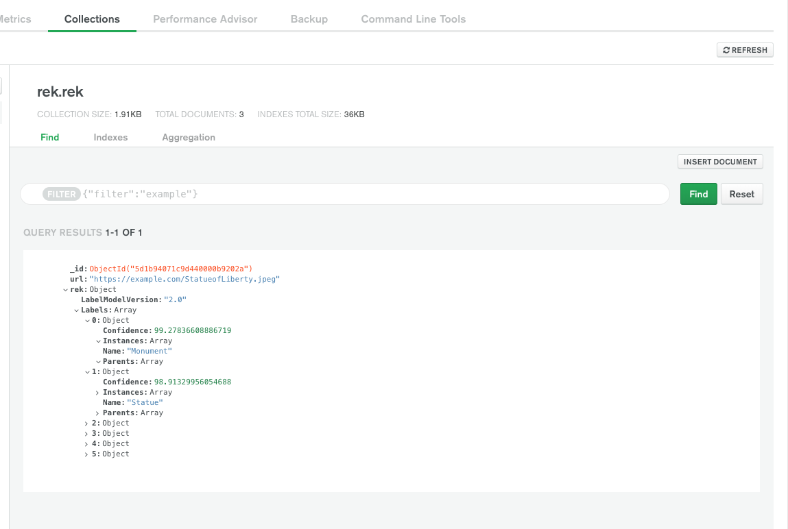

# Background

This is an interactive portion of the workshop. The end state is that we will create a database trigger that, when a document is inserted with an attribute called `URL` that it will call the AWS Rekcognition API to describe what the JPEG is a picture of.

Here will do this with the AWS object within Stitch.

The cluster should already be deployed so follow that tutorial first.

# Using Stitch to Make REST Requests

## Enable outbound REST calls

* On the main Atlas landing page, click "Stitch" under services



* Press the green "Create New Application" button in the top right
* Give the application a name. Here I chose "webapi" and leave everything else default. Click the green "Create" button. This may take several minutes to initially configure.



* On the left, choose "Services" under "Control" 
* Press the green "Add a Service" in the top right



* In the "Add a Service" page, choose the "AWS" service, give it a name (here I chose aws), complete filling in the form with your AWS Access Key ID, create a new secret and store it in Secret Access Key Value, then press the green "Add Service" button



* Add a rule by giving it a name, here rek, then click the green "Add Rule"
* Click on rek
* In the drop down choose the API of rekognition and the action of DetectLabels then save



* Add another service. Press the green "Add a Service" in the top right


* In the "Add a Service" page, choose the "HTTP" service, give it a name (here I chose hook), then press the green "Add Service" button



* We now have a service which knows how to issue HTTP requests. 
* Next we want to create a trigger that, when a document gets inserted that has a `URL` attribute, it will call AWS Rekognition to identify what it is a picture of, then update the document.

## Enable triggers

* Press the "Triggers" button then the "Add a Trigger" green button



* We will fill out the form accordingly such that:
* The type is Database Trigger
* We can leave the default name if you want
* Make sure it is enabled
* We can leave Event Ordering on or off, doesn't matter here
* Choose your cluster (there should only be one)
* Create a new database called `rek`
* Create a new collection called `rek`
* Operation type is `Insert` only, leave all others unchecked



* Choose to get the full document
* Create a new function, here I am calling it `rekTrigger_oninsert`



* put the following code in the text box for the trigger. Comments are inline

```
// add the async declaration so that way we simplify javascript promises
exports = async function(changeEvent) {
  // if we checked the box above, we can have the full document when the trigger runs
  var doc = changeEvent.fullDocument;
  
  // only run if the document has a url attribute
  if(doc.hasOwnProperty('url')){
    // handler to db
    var conn = context.services.get("mongodb-atlas").db("rek").collection("rek");
    // we created these two services earlier
    const aws = context.services.get('aws');
    const httpService = context.services.get("hook");
    
    // aws rekognition expects a bit stream, not the path to the image
    // so do an http get to get the image first
    var uri = doc.url
    var args = {"url":uri, "headers": {"Content-Type":["image/jpeg"]}};
    var req = httpService.get(args);
    var img = await req;
    
    // we now have the bits making up the image. pass them to aws rek
    try {
        var awsreq = aws.rekognition().DetectLabels({"Image": {"Bytes":img.body}});
        var res = await awsreq;
        // update  that mongodb document with the response
        // here we set the rek attribute to what the API returned
        conn.updateOne({_id:doc._id},{$set: {rek: res}});
      } catch (error) {
        console.log(JSON.stringify(error));
      }
    
  }
};
```

* save the trigger
* Insert a document into the database with a `URL` attribute which is a full path to a JPEG
* Notice the trigger runs and updates the document with the AWS Rekognition results



# Extra Credit:

MongoDB Atlas and Stitch have extra features up its sleeve to improve this section. Here are some examples you may be interested in furthering this application: 

* Try using the S3 API within stitch to query or put files there
* Make a web page using MongoDB Stitch QueryAnywhere to show these records
* Upload that webpage to Stitch Hosting